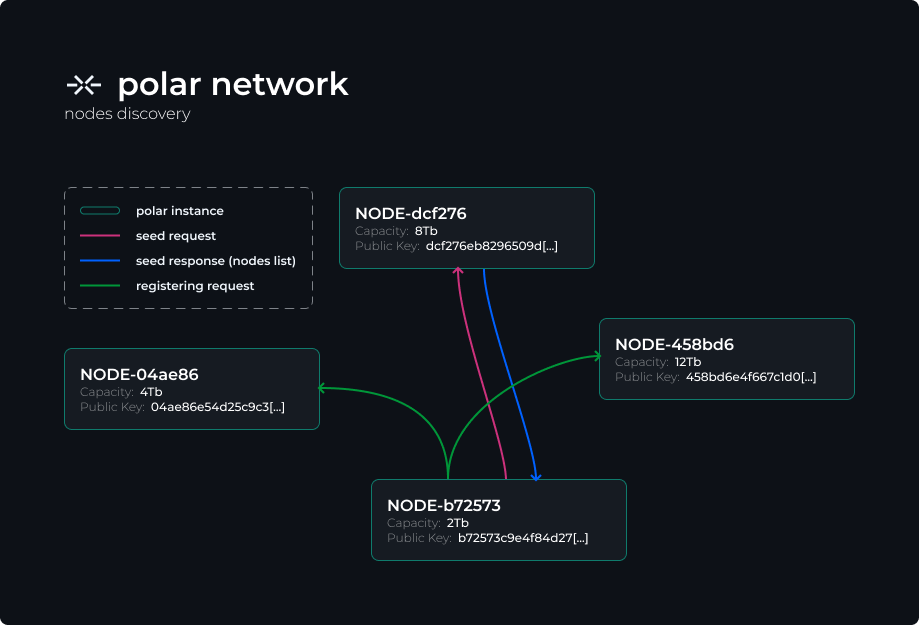

// This is a draft! not the final version!
# The Polar Protocol
## Decentralized object storage network for resilient services
Update of May 13th 2022
by [monoko](https://codeberg.org/monoko)

### I. Introduction
For years, governments of the world always tried to keep control over the citizens of their countries by creating new “security laws”, “anti-terrorist act”, “data protection law”. The years has passed by and now we are starting to experience a high level of surveillance that is strongly impacting the democracies in the world. Many example can be taken in dictatorships like China which is famous for its terrible repression and their surveillance technologies but also in India where the intelligence agencies are monitoring activists to arrest them or even more recently in France and other Europeans countries where the police does not hesitate to get information about climate activists by justifying this with "anti-terrorist" laws.

Even in countries where human rights are known for “”being respected””, political censorship and control is becoming something almost normal, something hard to fight since everything is stored by big companies and can be easily censored.

To avoid this we have built a lot of different tools like encrypted message apps, self-hosted solutions, onion routed VPNs, etc. But most of the already existing ones face a lot of issues like signal where phone numbers and centralisation are a big secruriy issue, like nextcloud wich is very useful for organizing but still lack a lot with privacy especially when we talk about encryption. Many exemple can be given. Also note that the services we talked about are still good services made by good people, they just don't fit the current and future issues of a specific a group of people (activist and journalists). Also we don't talk about the lack of data resiliency in theses kind of projects.

The idea of Polar is born from this conclusion: We need an anonymous network that collect the least metadatas, that allow file storage with a zero trust stategy (all the encryption, etc is made on the client side).
The network also need to be developped by a decentralized organization that doest not compromise and work with governements.

### II. Architecture
The goal of polar is to create an open decentralized network where each instances can be reached through a public REST API, a bit like amazon S3.
So each instances can store data but also will act as a gateway for the users and services using it.

A simple network made of 4 nodes will look like this:


As you can seen the polar nodes also act as gateway nodes for the services hosted on the same infrastructure. Polar will expose 2 REST API, one will be "public" to allow user managing their identity and their files and. Then a "private" API is exposed on another port, all the requests will need a signed private token; this private API will be used by services depending of the polar network to authenticate and manage user's files, no personal datas will go through it, only temporary access tokens but we will talk more about how interactions between users, services and polar work during the rest of this paper.

### III. How it's working?
#### 1. Nodes discovery
First, we need to build a private network, for this we need a discovery service that will allow new nodes to join the network. When starting a node for the first time, a “seed server” can be specified in the command line if it’s not specified polar will use the public instance of coldwire (https://polar.coldwire.org) and if polar see that some nodes are already registered on the local database it will just pick a random node from the list and send a “seed request” to it. Not that a "seed server" is a nomarl polar instance like every others.



To give an example of the discovery protocol, like in the figure below, we will take two server, *dcf276* which will act as a seed and *b72573* as a node whose willing to register itself. First the "new node" send a “seed” request to the seed server, which answer with a list of all the node it collected during its lifetime, then the "new node" will notify every nodes that does not apper in its database by sending a “register” request.

#### 2. Data storage

##### <u>**Data block**</u>

A data block is basically made of an id and a data field of 10240B (10Mb) max.
A data block is always private, this mean that to access it you need to sign your request with your private key which then will be compared with the id (that have to be signed when sending it)
The content of the data **MUST** be encrypted!! We can't trust every nodes on the network and clear datas can be read, even if it just a 10Mb chunk of a 2Gb file, this still dangerous.

Note that every bloc are replicated overs 3 nodes

in JSON it would look likes this:
```json
{
  "id": "<256 bits signed hash>",
  "data": "<10240 bits encrypted datas>"
}
```

##### <u>**Entity**</u>

An entity is exactly like a data block, expect that it's public, you just need the id/hash to access it and there is an unencrypted accessible field for the public key of the entity used to check signatures.

in JSON it looks like that:
```json
{
  "id": "<256 bits hash>",
  "public_key": "<user's ed448 public key>", // The ed25519 algoright is currently used in coldwire but will probably move to ed448, need to learn more about it
  "data": "<10240 bits encrypted entity data>"
}
```

the encrypted data might look like this:
```json
{
  "username": "monoko",
  "private_key": "<user's ed448 private key>",
  "files": {
    "<name>": {
      "size": <size>,
      "checksum": "<blake3 hash>",
      // Nodes where the metadatas are stored
      "meta": [
        "0.0.0.0:1312",
        "1.1.1.1:1312",
        "4.4.4.4:1312",
      ]
    }
  }
}
```

##### <u>**Metadatas**</u>

Metadatas are normal datas blocs it's just that instead of putting a file chunk in it we put a json with information about every single chunks of the file, like every data blocks, its replicated 3 times overs 3 nodes

a metadata block:
```json
[
  {
    "hash": "<blake3 hash of the chunk>",
    "servers": [
      "4.2.3.1:1312",
      "9.24.12.5:1312",
      "248.12.12.4:1312"
    ]
  }
]
```

##### <u>**About encryption**</u>

We recommend to encrypt the data with Chacha20-Poly1304 using an Argon2 key derivation on the user's password for an easier way of accessing the data, but of course you can use your own encryption protocol, just know that you'll probably need to use a fork of the polar client library.
Also the ed25519/448 is still mandatory, it will be needed to veryfy your ownership of your files.


#### 3. Data ownership

```json
// TODO

still have some questions, actually the current system works with comparing the signed hash of the chunk and the signed hash sent through a download request for exemple, if the hashes match, well it's your file and polar accept the request but if not polar reject the request. The issue with that is that you just need the hash to access the data, of cours the hash is very long and every chunk have a different one, hosted on different node: good luck, but I still see this as a potential vulnerability: a better way have to be found for comparing signatures
```

#### 4. Services, user and polar interations


```json
// TODO

notes: services will never see a single bit of data, everything MUST happpen on the client side using the polar client lib (native or wasm), encryption of files, chunk hashes and signing of theses hashes.
The services will just ask to the polar instance for a list of nodes to use and a random temporary 256bit access token sent to every nodes that will handle an upload, which will revoke when the upload of the chunk is done.

    (ask to upload a file on bloc)  (ask polar to pick nodes for a file of <size>)
[user] -----------------------> [bloc] --------------------------------------> [polar]
                                  |---> (store filename, etc for folders, etc)    |
                                                                                  |
                                                                                  |
         (send the list of nodes + random token through a websocket tunnel)       |
[user] <---------------------------------------------------------------------- [polar]
  |
  |
  |
[user] (separate files in chunks and encrypt them with randomly generated)
  |
  |  (send files chunks and push a metadata block)
  |
  |------> [polar-cc74de]
  |------> [polar-daac4b]
  |------> [polar-d4f22d]
```